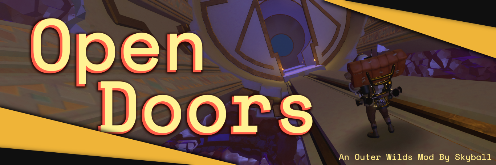

# Open Doors (Outer Wilds Mod)

This Mod will allow you open any closed doors and other pathways in the Game Outer Wilds.

Here are some **[example locations](doc/showcase.md)** for you to try out, or see the list of affected elements below.

## Controls

The `O` key is the activation key for this mod. You will have to hold it down while pressing the keys below:

| Key       | Action                                                   |
|:----------|:---------------------------------------------------------|
| `O` + `I` | Open surrounding pathways (ignores specific objects) |
| `O` + `K` | Open surrounding pathways (all)                      |
| `O` + `P` | Close surrounding pathways                               |
| `O` + `9` | Reduce door search radius by 10                          |
| `O` + `0` | Increase door search radius by 10                        |

It is recommended to close the pathways after using them, otherwise you might stumble on some missing geometry
later on.

## Affected Objects

This currently includes:

- all occurrences of:
    - [large orb doors](doc/showcase_nomai_mines_large_door.png)
    - [single/both sided rotating orb door](doc/showcase_high_energy_lab_door.png)
    - [tractor beams](doc/showcase_hanging_city_tractor.png) (toggle active) (use `O` + `K` for this)
    - [cacti](doc/showcase_sun_tower_cacti.png)
    - [ghost matter](doc/showcase_high_energy_lab_ghost_matter.png)
    - emergency hatches
    - [nomai space airlocks](doc/showcase_white_hole_station_airlock.png)
    - [stranger two-winged doors](doc/showcase_damaged_laboratory_door.png) (+ [those in dream world](doc/showcase_hotel_visit_friends_with_light_on_door.png))
  - [stranger secret passage murals](doc/showcase_tower_puzzle_mural.png) (+ [those in dream world](doc/showcase_hotel_hidden_mural.png))
  - [stranger elevators](doc/showcase_abandoned_temple_elevator.png) (removes entire elevator)
- and some specific places
    - [crashsite caves anglerfish overlook: stalagmites that block the way](doc/showcase_crashsite_path_stalagmites.png)
    - [lakebed: first maze cave part stalagmites](doc/showcase_lakebed_rocks.png)
    - [sunless city eye shrine: glass window](doc/showcase_sunless_city_eye_shrine_glass_symbol.png) (messes up gravity
      direction when passed through)
    - [sunless city cannon path: stones and cacti in ghost matter building](doc/showcase_sunless_city_cannon_path.png)
    - [tower of quantum knowledge: gravity stairs](doc/showcase_quantum_tower_stairs.png) (not visually, only gravity
      volumes are spawned)
    - [tower of quantum knowledge: scout launch holes on middle section](doc/showcase_quantum_tower_window.png)
    - old settlement: center piece probe window
    - [orbital probe cannon: debris blocking launch module](doc/showcase_orbital_probe_cannon_debris.png)
    - [interloper: melting ice on sunward side](doc/showcase_interloper_sunward_side_ice.png)
    - [interloper: specific ghost matter patches](doc/showcase_interloper_interior_ghost_matter.png)
    - [interloper: ice spires around comet](doc/showcase_interloper_ice_spires.png) (**!** *disables all ice collision,
      make sure to stand on stone* **!**) (use `O` + `K` for this)
    - [quantum moon, giant's deep: north pole tornado](doc/showcase_quantum_moon_giants_deep_tornado.png)
    - quantum moon, dark bramble: north pole brambles (**!** *disables ground collision on entire planet, use
      jetpack* **!**) (use `O` + `K` for this)
    - [stranger dam combination house: scout launch hole](doc/showcase_signal_jammer_scout_wall.png)
    - [stranger bell: prisoner vault](doc/showcase_prisoner_vault_open.png)

... and more!

Please do not judge the code too harshly, this is my first time writing C# and using Unity. I've had a blast creating
this and I really hope you enjoy using it!
